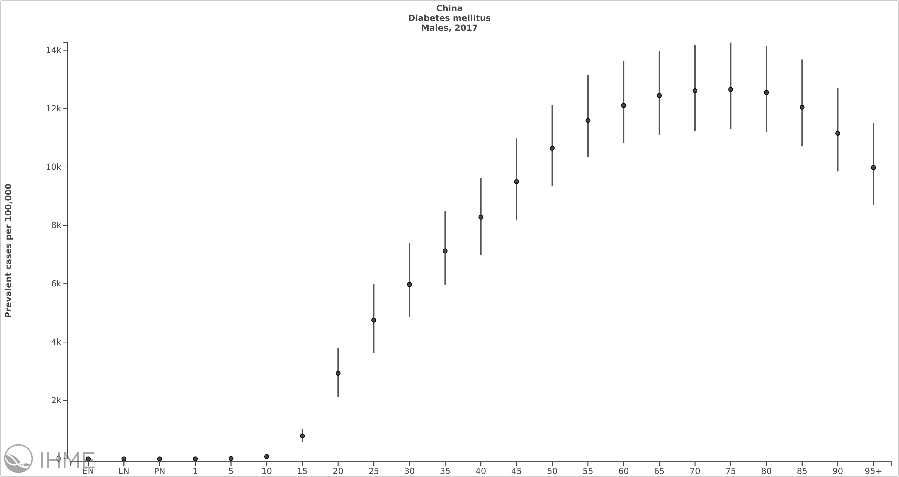
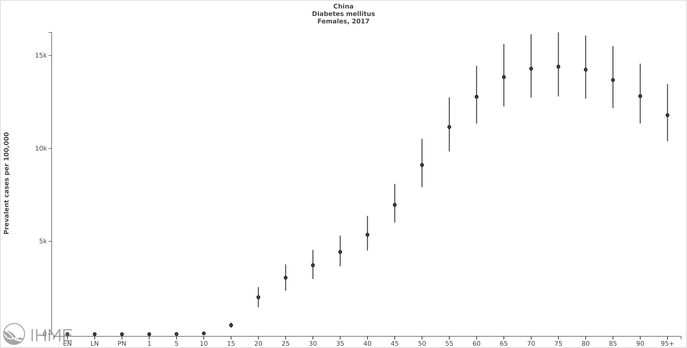

# COVID-19
Data and code repository for the Open COVID-19 Data Working Group: a global and multi-organizational initative that aims to  enable rapid sharing of trusted and open public health data to advance the response to infectious diseases.

# Acknowledgements
We first want to thank all those individuals and organizations across the world who have been willing and able to report data in as open and timely manner as possible. This work attempts to synthesize information from across a myriad set of data sources. Each entry in our database has an associatd source. A number of individuals have contributed to the specific data added here and their names and details are listed below along with citations.

Please get in touch should you want to contribute line list data, have any questions or just want to say hi: pigottdm@uw.edu or moritz.kraemer@zoo.ox.ac.uk

We promote open collaboration among researchers and encourage users of these data make best efforts to collaborate with representatives of the groups that generated data and involve them in their analyses where appropriate. Please get in touch should you require more information.

# Reconstructed line lists and data descriptor

Daily updates are usually processed by 10pm PT (1am EST, 6am GMT) and can be found the [latest data folder](/latest_data).

A full description of the methodology used for this study can be found here: Xu, B., Gutierrez, B., Mekaru, S. et al. Epidemiological data from the COVID-19 outbreak, real-time case information. Sci Data 7, 106 (2020). https://doi.org/10.1038/s41597-020-0448-0

And a short summary of the data can be found here: Xu B, Kraemer MUG, Open COVID-19 Data Working Group. Open access epidemiological data from the COVID-19 outbreak. Lancet Infect Dis. 20(5):534 (2020). https://doi:10.1016/S1473-3099(20)30119-5

A dashboard showing the data can be viewed here: https://www.healthmap.org/covid-19/

# Co-morbidity estimates

Co-morbidity data may facilitate CFR estimation processes

Datasets derived from Global Burden of Disease on prevalence rates of known co-morbidities, including Diabetes mellitus, Cardiovascular Disease, and Chronic Obstructive Pulmonary Disorder. For more information on these estimates please see [metadata](/co-morbidities/co-morbidity_metadata.txt) and https://vizhub.healthdata.org/gbd-compare/




# Global Demographic information

Global demographics, with age and sex structure are provided. These are mirrors of estimates from the Global Burden of Disease 2017, publically available here - http://ghdx.healthdata.org/record/ihme-data/gbd-2017-population-estimates-1950-2017. For further information please consult https://www.thelancet.com/journals/lancet/article/PIIS0140-6736(18)32278-5/fulltext


# Contributions
## Sources

[Current sources used](/sources_list.txt)

## Specific Contributors

We want to specifically thank the different regional working groups, including the Africa Open COVID-19 Data Working Group (https://github.com/dsfsi/covid19africa) and LATAM Open COVID-19 Data Working Group.

A list of curators and contributors to the Open COVID-19 Data Working Group is provided below:

Name | Twitter | Github | Email
-----|-------|---------|-------
Abdullahi Kawu||abdullahikawu
Albert Doughan||adoughan1
Alex Benjamin||axmb|alexbenjamin@google.com 
Alexander Zabreski|||aezarebski@gmail.com
Allyson Pemberton ||allysonjp715|allysonjp@google.com
Alyssa Loskill|||aloskill@bu.edu
Amanuel Getachew||amanbk12
Anastasia Lambrou|@anasophlambrou||anastasia.lambrou@jhu.edu
Andrew Auruku||aurukua	
Anya Nyman||anya-nyman	
Arianna Maever Amit|||alamit@up.edu.ph
Bernardo Gutierrez|@B_Gutierrez_G|BernardoGG|bernardo.gutierrez@zoo.ox.ac.uk
Bo Xu	| @BoXu55686629	| BoXu123	| xu-b15@mails.tsinghua.edu.cn
Carel Nchachi		||Carel08	
Carl Britto		|||	carl.britto@paediatrics.ox.ac.uk
Carrie			
Daniel Omolo	||	Jomo20	
Darlan Candido	|@candido_darlan	||	darlan.dasilvacandido@merton.ox.ac.uk
David Pigott|	@davidmpigott	||	pigottdm@uw.edu
Devon Jarvis	||	JarvisDevon	
Diane Igoche	||	deelearn	
Dieudonné Niyitanga	||	dniyitanga	
Elaine Nsoesie		|||	onelaine@bu.edu
Enrique Estigarribia	|||		enrique-estigarribia@hotmail.com
Ernest Offiong	||	ernoff	
Flavia Salles		|||	flacrissalles@gmail.com
Harvey Davis	|||		harvey.davis@gtc.ox.ac.uk
Herkulaas Combrink	||	MikeMcMalace	
Ian Gregorio-de Souza			
Idris Oladele Muniru	||	idrismunir15	
Isha Berry	| @ishaberry2	||	isha.berry@mail.utoronto.ca
Ismaël Koné	 ||	iskode	
James Azam	||	jamesmbaazam	
Jean Paul Carrera |	@JeanCarrPaul	||	jean.carrera@lincoln.ox.ac.uk
Jeanet Morienyane			
Jenny MG Shelton	|||		j.shelton@imperial.ac.uk
Jessie Wu	||	jessiewu	| chiehhsi.wu@gmail.com
John Brownstein
Jose Martinez		|||	zegmartinezch@gmail.com
Juan Pablo Cordova	|||		jpablo20048@gmail.com
Julia Morgan	|||		morgaj5@uw.edu
Kamorudeen Amuda	||	akindele2012	
Kara Sewalk	|@kara_sewalk		|| Kara.Sewalk@childrens.harvard.edu
Karen Santiago	| @itzelmardesiche	||	santiagomardesichekaren@gmail.com
Kate LeGrand | | klegrand15 | kel15@uw.edu
Kazeem Hakeem	||	hakymulla	
Kelly Moran | | khmoran|khmoran@google.com
Kernie Obimakinde||dakrownie|kernie@google.com
Kundai Gwatidzo	||	epicpewpew	
Lauren Goodwin		|||	lauren.goodwin@childrens.harvard.edu
Leslie Leland||leslieleland|lesliele@google.com
Lin Wang |	@fdlwang	||	lin.wang@pasteur.fr
Liz Hurley		|||	elizabeth.hurley@childrens.harvard.edu
Lizel Greyling	||	lizelgreyling	
Lucy Matkin		|||	lucy.matkin@zoo.ox.ac.uk
Mahamat Hamdan	||	axmat	
Mahlet Konjit-Solomon		|||	mahlet.nigatu@gmail.com
Manoli Heyneke	||	hey-mano	
Manu Cornet ||Imanul|manucomet@google.com
Manuel Muvhango	 ||	ManuelMuvhango	
Marcos			
Marcos Antonio Escurra		|||	marcos1996escurra@gmail.com
Marcos Escurra		|||	marcos1996escurra@gmail.com
Maria Mercedes Cobo	| @meche_cobo	||	maria.cobo@paediatrics.ox.ac.uk
Marie Orschulik	 ||	morschulik	
Million Abayneh	||	millzon	
Modupe Coker	||	moyegunle	
Molly Godfrey		|||	molly.d.godfrey@gmail.com
Moritz Kraemer	| @mougk	| mougk	| moritz.kraemer@zoo.ox.ac.uk
Moseli Motsoehli			
Moses Ronoh	||	moses1065	
Mostafa El Habib Daho	||	Mostafa-EHD	
Nuno Faria |	@nmrfaria	||	nuno.faria@zoo.ox.ac.uk
Olaniyan Oluwasegun		|| Segun12	
Oliver G Pybus |@EvolveDotZoo|| oliver.pybus@zoo.ox.ac.uk
Omara Patrick			
Onesimo Mtintsilana		|| oniemtie	
Pablo Reyes		|||	preyesa19@gmail.com
Pamela Andrade	|||		pamelandrade22@gmail.com
Raul Aveiro	| @Raulaveiro	||	raul.aveiro45@gmail.com
Rebecca Cogen | | | cogenr@uw.edu
Sabrina Li |	@sabrinalyli	||	sabrina.li@ouce.ox.ac.uk
Sam Ewald | | sewald01 | ewalds2@uw.edu
Sam Scarpino |	@svscarpino	||	s.scarpino@northeastern.edu
Sang Woo Park |	@sang_woo_park |	parksw3	| swp2@princeton.edu
Sarah Hill	| @Hill_SarahC	||	sarah.hill@zoo.ox.ac.uk
Sheriffo Ceesay	||	sneceesay77	
Shingirai Pfumayaramba	||	shingiraip	
Shivanand Guness	||	shivam11	
Stefanie Watson || stefanieaw | watsonsa@uw.edu
Stephen Radcliffe||sratcliffe118|sratcliffe@google.com
Steve Bachmeier|| stevebachmeier|sbachmei@uw.edu
Sumiko Mekaru	| @Sumiko_Mekaru	||	Sumiko.Mekaru@childrens.harvard.edu
Tahir	||	tahirlanre	
Thomas Brewer		|||	Thomas.Brewer@childrens.harvard.edu
Thomas Rawson		|||	thomas.rawson@pmb.ox.ac.uk
Timothé Faudot ||attwad|timothe@google.com
Tsige Gebreslasse			
Veincent Pepito		|||	vpepito@ateneo.edu
Vongani Maluleke	||	Von31	
Vukosi Marivate		|||	vukosi.marivate@cs.up.ac.za
Willard Zvarevashe		wzvarevashe	
Yaset Caicedo	| @yaset_caicedo	||	eyaset@gmail.com
Zakia Salod	||	ZakiaSalod	
Zamasomi Luvuno			
Zoë Willis		|||	znw23@hotmail.co.uk

## Citation

In order to cite the current version of the dataset please use the citation below. As the data are updated regularly, please update the retrieval date in the `howpublished` field.

```{bibtex}
@misc{kraemer2020epidemiological,
  author =       {Open COVID-19 Data Working Group},
  title =        {{Detailed Epidemiological Data from the COVID-19 Outbreak}},
  howpublished = {Accessed on yyyy-mm-dd from
                  \url{http://virological.org/t/epidemiological-data-from-the-ncov-2019-outbreak-early-descriptions-from-publicly-available-data/337}},
  year =         2020
}

```

and

In order to cite the original dataset and methodology of how it was collected please use:

```{bibtex}
@article{xu2020Epidemiological,
  author = {Xu, Bo and Gutierrez, Bernardo and Mekaru, Sumiko and Sewalk, Kara and Goodwin, Lauren and Loskill, Alyssa and  Cohn, Emily and Hswen, Yulin and Hill, Sarah C. and Cobo, Maria M and Zarebski, Alexander and Li, Sabrina and Wu, Chieh-Hsi   and Hulland, Erin and Morgan, Julia and Wang, Lin and O'Brien, Katelynn and Scarpino, Samuel V. and Brownstein, John S. and Pybus, Oliver G. and Pigott, David M. and Kraemer, Moritz U. G.},
  doi = {doi.org/10.1038/s41597-020-0448-0},
  journal = {Scientific Data},
  number = {106},
  title = {{Epidemiological data from the COVID-19 outbreak, real-time case information}},
  volume = {7},
  year = {2020}
}

```

