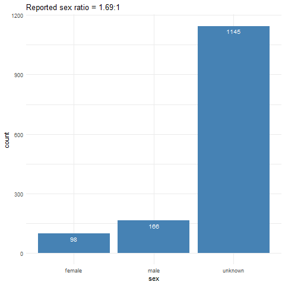

# nCoV2019
Location for summaries and analyses of data related to n-CoV 2019, first reported in Wuhan, China.

# Acknowledgements
We first want to thank all those individuals and organizations across the world who have been willing and able to report data in as open and timely manner as possible. This work attempts to synthesize information from across a myriad set of data sources (which are listed below). A number of individuals have contributed to the specific data added here and their names and details are listed below along with a citation.


# Reconstructed line lists

Line lists also posted and updated at https://docs.google.com/spreadsheets/d/1itaohdPiAeniCXNlntNztZ_oRvjh0HsGuJXUJWET008/edit#gid=0

[Hubei cases](/ncov_hubei.csv) Last updated to public sheet: 1930 GMT 1st February 2020

[Outside Hubei cases](/ncov_outside_hubei.csv) Last updated to public sheet: 1930 GMT 1st February 2020

# Basic summary stats
## Sex (updated 25th Jan 2020)



# Contributions
## Sources
[Current sources used](/source_list.csv) Last updated 25th January

## Specific Contributors

Name | Email | Twitter | Github
-----|-------|---------|-------
Bernardo Gutierrez | bernardo.gutierrez@zoo.ox.ac.uk | @B_Gutierrez_G |
Sarah Hill | sarah.hill@zoo.ox.ac.uk | @Hill_SarahC |
Moritz Kraemer | moritz.kraemer@zoo.ox.ac.uk | @mougk | @mougk
Sabrina Li | sabrina.li@ouce.ox.ac.uk | @sabrinalyli |
Alyssa Loskill | aloskill@bu.edu | |
Sumiko Mekaru | srmekaru@gmail.com | @Sumiko_Mekaru |
David Pigott | pigottdm@uw.edu | @davidmpigott |
Sam Scarpino | s.scarpino@northeastern.edu | @svscarpino |
Kara Sewalk | Kara.Sewalk@childrens.harvard.edu | @kara_sewalk |
Lin Wang | lin.wang@pasteur.fr | @fdlwang |
Jessie Wu | chiehhsi.wu@gmail.com | | @jessiewu
Bo Xu | xu-b15@mails.tsinghua.edu.cn  | @BoXu55686629 | @BoXu123
Alexander Zabreski | | |

## Citation

As the data are updated regularly, please update the retrieval date in the `howpublished` field.

```{bibtex}
@misc{kraemer2020epidemiological,
  author =       {nCoV-2019 Data Working Group},
  title =        {{Epidemiological Data from the nCoV-2019 Outbreak: Early
                  Descriptions from Publicly Available Data}},
  howpublished = {Accessed on yyyy-mm-dd from
                  \url{http://virological.org/t/epidemiological-data-from-the-ncov-2019-outbreak-early-descriptions-from-publicly-available-data/337}},
  year =         2020
}
```
